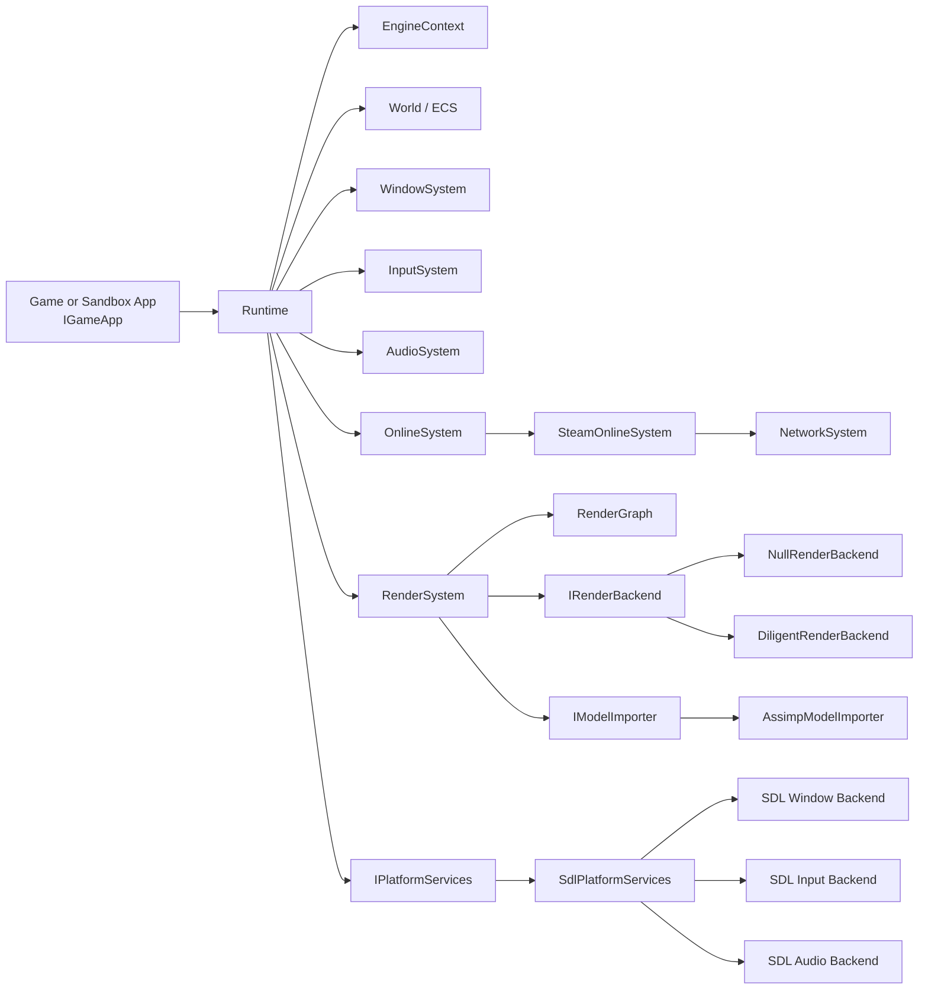

# CoreEngine

CoreEngine is a modular C++23 game engine prototype focused on clear subsystem boundaries, backend isolation, deterministic runtime lifetime, and performance-conscious rendering and scene execution. The repository builds a static engine library (`CoreEngine`) and a runnable sandbox application (`sandbox`) that demonstrates real-time voxel terrain generation, streaming, rendering, and camera controls.

The project is currently organized around a reusable engine core plus platform-specific adapters. Game/sample code lives in `app/`; reusable engine code lives in `core_engine/`.

## Current Status

CoreEngine is an active engine codebase, not a production-ready commercial engine. The current checkout includes:

- C++23 static engine library.
- Runtime shell with deterministic initialization and shutdown.
- SDL3-backed platform services for windowing, input, event pumping, and audio.
- Render system with backend abstraction, render graph stages, default scene pass, batching, frame resources, frame buffers, materials, textures, meshes, and model loading.
- Optional Diligent Engine backend support for D3D11, D3D12, and Vulkan where supported by the platform and build configuration.
- Null render backend for configuration/testing paths where rendering is intentionally disabled.
- ECS scene model powered by EnTT, wrapped by engine-owned `World` and `Node` APIs.
- Engine-owned math types and helpers.
- Input action binding layer for keys, mouse buttons, and 2D axes.
- Audio system abstraction over platform audio backend.
- Model import abstraction with an Assimp implementation.
- Steam-oriented online/network MVP behind app-facing interfaces.
- Move-aware future/promise helper for asynchronous resource flows.
- Voxel terrain sandbox with worker-thread chunk generation, main-thread GPU upload, streaming, and distant LOD mesh generation.


## Architecture Overview

The engine is intentionally split into stable core-facing interfaces and concrete platform/backend implementations.



### Runtime

`CoreEngine::Runtime` owns the engine lifetime. It creates and shuts down subsystems in a deterministic order:

1. Bind global application/world access services.
2. Initialize logging.
3. Create the ECS world.
4. Initialize online services.
5. Resolve the requested render backend.
6. Create the platform window.
7. Create input and audio systems.
8. Initialize the render system.
9. Call `IGameApp::Init`.
10. Run the frame loop.
11. Call `IGameApp::Shutdown`.
12. Shut down render, online, input, audio, window, platform services, world, and logging.

The frame loop keeps app logic separate from engine services:

```text
Runtime::Tick()
  -> input begin/commit
  -> window/platform event pump
  -> resize handling
  -> shutdown request handling

OnlineSystem::BeginFrame()
RenderSystem::BeginImGuiFrame()
IGameApp::Update()
OnlineSystem::EndFrame()
RenderSystem::RenderFrame()
```

### Application Contract

Apps implement `CoreEngine::IGameApp`:

```cpp
class MyApp final : public CoreEngine::IGameApp {
public:
    void Init(const CoreEngine::EngineContext& context) override;
    void Update(const CoreEngine::FrameContext& frame) override;
    void Shutdown(const CoreEngine::EngineContext& context) override;
};
```

The app receives an `EngineContext` with references to:

- `World`
- `AudioSystem`
- `InputSystem`
- `IOnlineSystem`
- `WindowSystem`
- `RenderSystem`

Engine startup is done through:

```cpp
CoreEngine::EngineConfig config;
config.windowWidth = 1280;
config.windowHeight = 720;
config.windowTitle = "My CoreEngine App";
config.renderBackend = CoreEngine::RenderBackendType::DiligentD3D11;

return CoreEngine::RunEngine(std::make_unique<MyApp>(), config);
```

## Core Modules

### `core/application`

Owns the runtime shell, application service binding, frame context, and engine context.

Important files:

- `runtime.h/.cc`
- `application.h/.cc`
- `engine_context.h`
- `frame_context.h`

### `core/ecs`

Wraps EnTT with engine-owned scene APIs.

Key concepts:

- `World`: owns the `entt::registry`.
- `Node`: lightweight entity handle with transform and hierarchy helpers.
- Components: `TransformComponent`, `HierarchyComponent`, `NameComponent`, `CameraComponent`, `MeshRendererComponent`.
- `WorldAccess`: narrow global binding for systems that need access to the active world.

The wrapper keeps game-facing code from depending directly on raw EnTT usage in most common workflows, while still exposing `Registry()` when lower-level access is appropriate.

### `core/render`

Owns high-level rendering concepts and delegates backend-specific work through `IRenderBackend`.

Current responsibilities:

- Backend abstraction through `IRenderBackend`.
- Game-facing render API through `IRenderContext`.
- Render graph and render pass execution.
- Frame-local render resources.
- Mesh, material, shader, texture, frame buffer, model, and render pass handles.
- Default ECS scene rendering.
- Mesh batching by material and mesh.
- Camera resolution from ECS camera components or manual override.
- Synchronous and asynchronous model loading.
- Texture caching for imported model materials.

Render passes are ordered by `RenderPassStage` and `order`:

- `FrameSetup`
- `Shadow`
- `DepthPrePass`
- `GBuffer`
- `Lighting`
- `ForwardOpaque`
- `ForwardTransparent`
- `PostProcess`
- `Debug`
- `UI`
- `Present`

To add a pass, implement `IRenderPass` and register it through `RenderSystem::AddRenderPass`.

### `core/window`

Defines engine-facing window state, events, descriptions, cursor modes, native handles, and backend interface.

`WindowSystem` owns an `IWindowBackend` and exposes:

- Initialization from `WindowDesc`.
- Per-frame event queue.
- logical and pixel extents.
- close state.
- native window handle for renderer creation.
- cursor mode control.

### `core/input`

Owns frame-stable input state. It receives platform input events and exposes:

- Key and mouse button current/pressed/released state.
- Mouse position, delta, and wheel.
- Fixed-capacity action bindings.
- 2D axis bindings.

Actions use stable `InputActionId` values instead of string names, which keeps per-frame lookup simple and avoids string work in hot paths.

### `core/audio`

Defines `IAudioBackend` and `AudioSystem`.

The current app-facing API supports:

- Initialization and shutdown.
- Pause/resume.
- Queueing interleaved `float32` audio samples.
- Querying queued bytes and backend error state.

### `core/assets`

Defines model import data structures and `IModelImporter`.

The current model pipeline supports:

- Meshes.
- Materials.
- Texture metadata and embedded texture data.
- Imported node hierarchy.
- Merge options.
- Left-handed conversion.
- Normal/tangent generation options.

The concrete importer currently lives in `platform/assimp`.

### `core/online` and `core/network`

The online layer exposes a gameplay-facing `IOnlineSystem` while the current implementation is Steam-oriented.

Current capabilities include:

- Online status reporting.
- Steam identity and overlay state.
- Lobby creation and joining.
- Invite overlay.
- Local avatar loading.
- Network session state.
- Peer tracking.
- Protocol handshakes.
- Steam P2P transport integration.

Steamworks is optional at build time. Use `--no-steam` for explicit offline builds.

### `core/math`

Provides engine-owned math value types and helpers. The public engine API uses these types instead of exposing third-party math types.

Current types include:

- `Vec2`, `Vec3`, `Vec4`
- integer and unsigned vector variants
- `Mat2`, `Mat3`, `Mat4`
- `Quat`

Current helpers include:

- angle conversion
- dot/cross/normalize/length
- interpolation and smoothstep
- transform composition
- matrix inverse/transpose
- perspective and orthographic projection
- left-handed look-at
- quaternion operations

### `core/async`

Provides a small move-aware future/promise helper used by asynchronous resource paths.

Notable behavior:

- `Future<T>` is a shallow-copy result handle.
- `FuturePromise<T>` is the producer endpoint.
- Callbacks are move-only through `FutureCallback`, so continuations can capture unique ownership.
- Continuations run on the thread that completes the promise.

### `core/log`

Provides `Log`, `Logger`, `ILogService`, and `ILogSink`.

The runtime binds a logger during initialization and installs a console sink. Logging should stay out of hot paths unless the cost is intentional and controlled.

## Platform Layer

Concrete platform integrations live outside `core/` under `core_engine/platform/`.

Current platform adapters:

- `platform/sdl`: SDL3 window, input, event pump, audio, and SDL lifetime context.
- `platform/diligent`: Diligent Engine render backend implementation.
- `platform/assimp`: Assimp model importer.
- `platform/*_factory.*`: factory functions that connect runtime/core interfaces to concrete implementations.

This boundary is important: new platforms or backends should be added behind existing interfaces instead of leaking native API objects into core systems.

## Rendering Backends

`RenderBackendType` currently supports:

- `None`
- `DiligentD3D11`
- `DiligentD3D12`
- `DiligentVulkan`

`None` creates a null backend. It is useful for non-rendering paths but will not display sandbox terrain.

Diligent backend availability depends on:

- `CORE_ENGINE_ENABLE_DILIGENT=ON`
- platform support
- generated Diligent targets
- Direct3D support on Windows for D3D11/D3D12
- Vulkan support where requested

The runtime resolves unavailable requested backends to `None` and logs a warning. The voxel sandbox explicitly requests `DiligentD3D11`, because the null backend cannot upload or render meshes.

## Sandbox Application

The current sandbox in `app/main.cc` demonstrates:

- Engine startup through `RunEngine`.
- ECS camera creation.
- Input action binding.
- A free debug camera.
- Voxel terrain generation.
- Background chunk build workers.
- Main-thread mesh upload.
- Chunk streaming around the camera.
- Stale chunk work pruning.
- Distant terrain LOD mesh generation.
- Explicit cleanup of ECS nodes and GPU resources before render shutdown.

Camera controls:

| Input | Action |
| --- | --- |
| `W`, `A`, `S`, `D` | Move camera horizontally relative to camera orientation |
| `Q`, `E` | Move down/up in world space |
| `Left Shift` | Sprint multiplier |
| Arrow keys | Keyboard look |
| Hold right mouse button and move mouse | Mouse look |

Voxel terrain tuning currently lives inside `VoxelWorldConfig` in `app/main.cc`. Terrain feature composition lives in `app/terrain_generator.*`.

## Dependencies

The repository vendors or references the following third-party projects:

- DiligentCore
- DiligentTools
- SDL3
- EnTT
- GLM
- Assimp
- robin-map
- Dear ImGui through DiligentTools third-party sources
- Steamworks SDK path/support files for Steam builds

The only submodule declared by `.gitmodules` in this checkout is:

```text
core_engine/third_party/DiligentCore
```

Initialize submodules after cloning:

```powershell
git submodule update --init --recursive
```

## Build Requirements

Recommended Windows development environment:

- Windows 10 or newer.
- Python 3.10 or newer for `build.py`.
- CMake 3.21 or newer for presets.
- C++23-capable compiler.
- Visual Studio 2022 / MSVC v143 for the Windows Direct3D/Diligent path.
- Ninja for the default script generator, unless using a Visual Studio generator.
- Git with submodules initialized.

The top-level CMake project declares `cmake_minimum_required(VERSION 3.14...4.6)`, but `CMakePresets.json` requires CMake 3.21.

## Build With `build.py`

`build.py` is the preferred build entry point for this repository because it checks requirements, configures CMake options, handles common Windows toolchain setup, and can run or package the target.

Check requirements only:

```powershell
python build.py --check-only --diligent --no-steam
```

Build the voxel sandbox with Diligent and no Steamworks dependency:

```powershell
python build.py --diligent --no-steam --target sandbox --config RelWithDebInfo --jobs 32
```

Build and run:

```powershell
python build.py --diligent --no-steam --target sandbox --config RelWithDebInfo --jobs 32 --run
```

Build with Steamworks enabled:

```powershell
python build.py --diligent --steam --steamworks-sdk-dir C:\Path\To\SteamworksSDK --steam-app-id 480 --target sandbox --config RelWithDebInfo --jobs 32
```

Package a release bundle:

```powershell
python build.py --diligent --no-steam --target sandbox --config Release --package
```

Useful `build.py` options:

| Option | Purpose |
| --- | --- |
| `--check-only` | Validate requirements without configuring or building |
| `--clean` | Delete the build directory before configuring |
| `--diligent` | Enable the experimental Diligent renderer backend |
| `--steam` | Enable Steamworks integration |
| `--no-steam` | Disable Steamworks integration for offline builds |
| `--steamworks-sdk-dir` | Point to a Steamworks SDK root |
| `--steam-app-id` | Set the development Steam AppID |
| `--target` | Select a CMake target, for example `sandbox` |
| `--config` | Select `Debug`, `Release`, `RelWithDebInfo`, or `MinSizeRel` |
| `--jobs` | Set parallel build jobs |
| `--run` | Run an executable after building |
| `--run-target` | Select which executable to run |
| `--package` | Copy the built executable bundle to `dist` or `--package-dir` |
| `--cmake-arg` | Pass additional arguments to CMake configure |

## Build With CMake Presets

Available presets:

| Preset | Generator | Backend | Steam | Target |
| --- | --- | --- | --- | --- |
| `windows-msvc-vs2022-debug` | Visual Studio 17 2022 | Diligent ON | OFF | `sandbox` |
| `ninja-debug-offline` | Ninja | Diligent OFF | OFF | `sandbox` |

Configure and build the Visual Studio preset:

```powershell
cmake --preset windows-msvc-vs2022-debug
cmake --build --preset windows-msvc-vs2022-debug
```

Configure and build the offline Ninja preset:

```powershell
cmake --preset ninja-debug-offline
cmake --build --preset ninja-debug-offline
```

The offline Ninja preset disables Diligent, so it is useful for compiling the core path without the render backend. It is not the right preset for visually validating the voxel sandbox.

## CMake Options

Important project options and cache variables:

| Option | Default | Description |
| --- | --- | --- |
| `CORE_ENGINE_ENABLE_DILIGENT` | `OFF` | Builds Diligent render backend support |
| `CORE_ENGINE_DILIGENT_CORE_DIR` | empty, then bundled path | Path to DiligentCore |
| `CORE_ENGINE_ENABLE_STEAM` | `AUTO` in CMake, enabled by default in `build.py` | Enables Steamworks integration |
| `CORE_ENGINE_STEAMWORKS_SDK_DIR` | auto-detected candidates | Path to Steamworks SDK root |
| `CORE_ENGINE_STEAM_APP_ID` | `480` | Steam AppID used by development builds |
| `CORE_ENGINE_REQUIRE_DIRECT3D_ON_WINDOWS` | `ON` | Fails configuration if Diligent Direct3D backends cannot be built on Windows |
| `CORE_ENGINE_COPY_MSVC_RUNTIME_DLLS` | `ON` | Copies MSVC runtime DLLs next to Windows executables |
| `CORE_ENGINE_COPY_DEBUG_MSVC_RUNTIME_DLLS` | `ON` | Copies debug CRT DLLs for developer handoff builds |
| `CORE_ENGINE_COPY_WINDOWS_UCRT_DLLS` | `ON` | Copies Windows UCRT DLLs next to Windows executables |
| `CORE_ENGINE_MSVC_REDIST_DIR` | empty | Optional explicit MSVC redist directory |

## Development Guidelines

CoreEngine code should preserve the current subsystem boundaries:

- Keep platform-specific code under `core_engine/platform`.
- Keep high-level engine concepts under `core_engine/core`.
- Keep sample/game-specific behavior under `app`.
- Prefer explicit interfaces for cross-module boundaries.
- Use RAII for native, GPU, file, platform, and resource lifetimes.
- Prefer handles for resources whose storage is owned by systems.
- Avoid leaking backend details into game-facing APIs.
- Avoid per-frame allocation, string formatting, and expensive map lookups in hot paths.
- Prefer batching and contiguous storage for render and ECS iteration paths.
- Keep asynchronous work from touching ECS nodes or GPU handles unless it runs on the owning thread.
- Make shutdown deterministic and safe when initialization partially fails.

## Adding Engine Features

### Add a Render Backend

1. Implement `IRenderBackend`.
2. Keep backend-specific includes and native handles inside `core_engine/platform/<backend>`.
3. Update `platform/render_backend_factory.*`.
4. Update CMake only for the new backend files and dependencies.
5. Preserve `RenderSystem` as the high-level owner of render flow.

### Add a Render Pass

1. Implement `IRenderPass`.
2. Return a precise `RenderPassDesc`.
3. Allocate backend resources lazily and release them through `ReleaseResources`.
4. Register the pass with `RenderSystem::AddRenderPass`.
5. Use `RenderPassContext` instead of directly depending on concrete backends.

### Add a Platform Backend

1. Implement `IPlatformServices`.
2. Provide window, input, event pump, and audio systems through core-facing types.
3. Keep native API details inside `platform/<name>`.
4. Update `platform_services_factory.*`.

### Add a Model Importer

1. Implement `IModelImporter`.
2. Convert imported data into `ModelAsset`.
3. Do not expose importer library types through `core/assets`.
4. Update `model_importer_factory.*`.

### Add a Game or Sample

1. Implement `IGameApp`.
2. Keep sample-specific systems in `app/` or a focused game module.
3. Create ECS nodes/components through `World` and `Node`.
4. Request engine resources through `EngineContext`.
5. Release render resources before render shutdown.

## Troubleshooting

### `python build.py` fails on Windows with an app execution error

Windows may resolve `python` to the Microsoft Store alias. Use a real Python executable or adjust the Windows App Execution Alias settings.

### DiligentCore is missing

Initialize submodules:

```powershell
git submodule update --init --recursive
```

Or set:

```powershell
-DCORE_ENGINE_DILIGENT_CORE_DIR=C:\Path\To\DiligentCore
```

### Direct3D headers or MSVC standard headers are missing with Ninja

Configure from a Visual Studio Developer Command Prompt, or use `build.py`, which is designed to locate/load the MSVC developer environment for the Windows Diligent path.

### Steamworks SDK is missing

For offline builds:

```powershell
python build.py --diligent --no-steam --target sandbox
```

For Steam builds, pass:

```powershell
--steam --steamworks-sdk-dir C:\Path\To\SteamworksSDK
```

### The sandbox window opens but no terrain is visible

Check that the build enabled a real render backend. The null backend can run the loop, but it cannot upload or render the voxel meshes.

### Runtime DLLs are missing next to the executable

The CMake helper functions copy SDL, Diligent shader compiler DLLs, MSVC runtime DLLs, and Windows UCRT DLLs when available. If a DLL is still missing, verify the MSVC redist and Windows SDK paths or set `CORE_ENGINE_MSVC_REDIST_DIR`.

## License

No top-level license file is present in this checkout. Add a license before redistributing the engine or publishing it as an open-source project.
